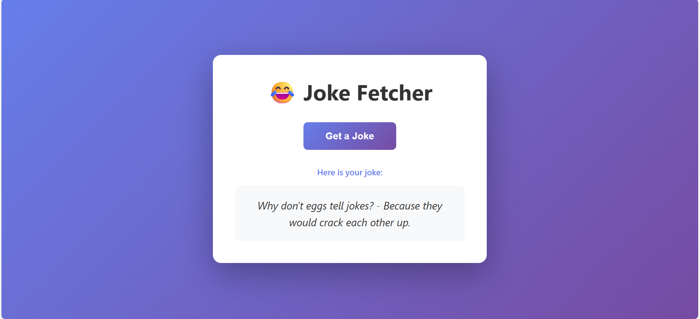

# 🎭 Random Joke Fetcher

A sleek, responsive web application that fetches and displays random jokes with a beautiful user interface.

## 📸 Preview



*Beautiful gradient UI with responsive design and smooth animations*

## ✨ Features

### Core Functionality
- **Real-time Joke Fetching**: Integrates with the Official Joke API to retrieve random jokes on-demand
- **Asynchronous Operations**: Implements modern async/await patterns for seamless API communication
- **Error Handling**: Robust try-catch error handling with user-friendly feedback messages
- **Dynamic Content Loading**: Status indicators (Loading..., Success messages) for enhanced user experience

### UI/UX Design
- **Modern Design**: Beautiful gradient background with smooth color transitions (purple gradient)
- **Responsive Layout**: Fully responsive design that adapts to all screen sizes (mobile, tablet, desktop)
- **Smooth Animations**: Interactive button hover effects with CSS transitions and lift animations
- **Professional Styling**: Clean, centered layout with proper spacing and typography using modern fonts

### Technical Implementation
- **Vanilla JavaScript**: Pure JavaScript without frameworks for lightweight performance
- **Fetch API**: Modern HTTP client using the Fetch API for API communication
- **DOM Manipulation**: Direct DOM element selection and manipulation for efficient rendering
- **Event Handling**: Click event listeners for interactive user interactions
- **CSS3 Features**: Flexbox layout, gradient backgrounds, media queries for responsiveness

## 🎨 Technologies Used

| Technology | Purpose |
|------------|---------|
| **HTML5** | Semantic markup structure |
| **CSS3** | Advanced styling with gradients, flexbox, and animations |
| **JavaScript (ES6+)** | Async/await, arrow functions, modern ES6 syntax |
| **Fetch API** | RESTful API communication |

## 🚀 How to Use

1. Clone the repository
2. Open `index.html` in your web browser
3. Click the "Get Joke" button to fetch a random joke
4. Watch the loading status update as the API processes your request

## 📋 Project Structure

```
random-joke-fetcher/
├── index.html     # HTML markup and styling
├── script.js      # JavaScript functionality
└── README.md      # Documentation
```

## 🔧 Code Highlights

### Async/Await API Integration
```javascript
async function fetchJoke() {
    try {
        const response = await fetch('https://official-joke-api.appspot.com/random_joke');
        const data = await response.json();
        jokeText.textContent = `${data.setup} - ${data.punchline}`;
        statusText.textContent = 'Here is your joke:';
        return data;
    } catch (error) {
        statusText.textContent = 'Failed to fetch joke.';
        console.error('Error fetching joke:', error);
    }
}
```

### Responsive Design
- Mobile-first approach with CSS media queries
- Flexible container with max-width constraints
- Adaptive font sizes and padding for all screen sizes

## 💡 Key Learning Outcomes

This project demonstrates:
- ✅ Client-side JavaScript development
- ✅ RESTful API consumption
- ✅ Asynchronous programming patterns
- ✅ Responsive web design
- ✅ User experience design principles
- ✅ Browser DevTools debugging (console logging)

## 🎯 Potential Enhancements

- Add joke categories/filtering options
- Implement local storage to save favorite jokes
- Add copy-to-clipboard functionality
- Include animation transitions for joke display
- Add dark mode theme toggle

## 📄 License

This project is open source and available for educational purposes.

---

**Made with ❤️ as a demonstration of front-end web development skills**
